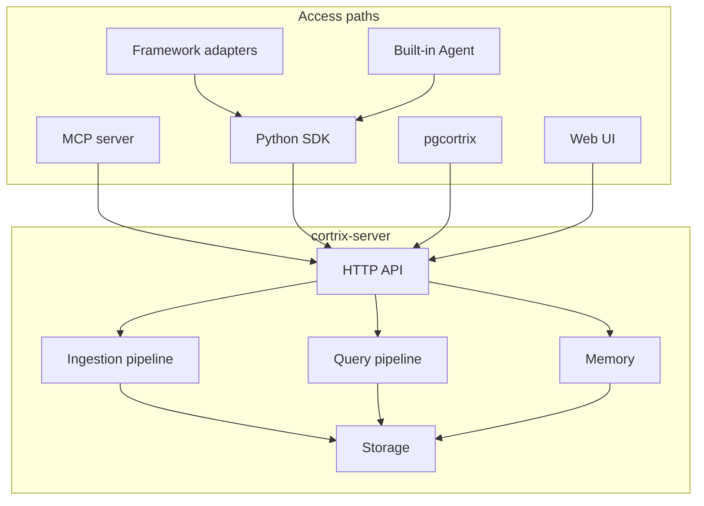

Cortrix is one server with several ways to reach it. Knowing how the parts fit together explains why the steps on other pages look the way they do.

## One server, several access paths {#one-server}

At the center of Cortrix is a single process, `cortrix-server`. It's written in C++, exposes an HTTP API, and contains all of the ingestion, storage, and retrieval logic. Everything else is a client of that API.

Two things follow directly from this shape:

- **Every access path has the same reach.** MCP tools, SDK methods, and SQL functions all end up calling the same HTTP endpoints, and none of them has a privileged channel. Even the built-in Agent reaches the server only through the public Python SDK.
- **There's one contract.** `api/openapi.yaml` is the authoritative definition of the HTTP API, and every other access path follows it.

## Inside the server {#inside-the-server}

### Ingestion pipeline {#ingest}

Once a document enters Cortrix, it's parsed, chunked, embedded, and indexed in the background. This is an asynchronous queue with persisted tasks: the upload request returns quickly, and you check progress through the task API.

The repository calls this pipeline SPC. The readiness check reports its queue depth and worker count under `spc_pipeline`.

### Query pipeline {#query}

At query time, several retrieval paths run in parallel. Their results are fused and then, optionally, reranked:

- **Vector search**: looks up BGE-M3 dense vectors in a persistent HNSW index.
- **Full-text search**: built on SQLite FTS5.
- **Sparse retrieval**: uses sparse vectors produced by the same BGE-M3 model.
- **Fusion**: merges the paths' results into one list by rank.
- **Reranking**: scores each candidate with a cross-encoder model. It's on by default.

A cross-namespace query fans the request out to each namespace, then merges and de-duplicates the results.

### Storage {#storage}

Each namespace has its own data:

| What | How it's stored |
|---|---|
| The vector index | A persistent HNSW index with snapshots and a write-ahead log |
| Metadata, the full-text index, and tasks | SQLite |
| The original uploaded files | File storage |

A single write touches the vector index, the database, and file storage. A write coordinator makes sure all three succeed or none of them takes effect.

Namespaces are loaded on demand. There's a limit on how many stay loaded at once, and a namespace is unloaded after it's been idle for a while.

### Local models {#models}

Embedding and reranking use two local ONNX models, run on your machine by ONNX Runtime on CPU, CoreML, or CUDA. They need no external service.

LLMs are a different matter. They're optional, they're configured per role, and only features such as enrichment, document summaries, memory extraction, and built-in Agent chat use them. With no LLM configured, ingestion and retrieval work as usual.

## How the repository maps to components {#repository-map}

| Directory | Component | Language |
|---|---|---|
| `src/`, `include/` | `cortrix-server` | C++17 |
| `api/` | The OpenAPI spec | YAML |
| `cortrix-mcp/` | MCP server | Python |
| `sdk/python/` | Python SDK | Python |
| `cortrix-skills/` | Framework adapters | Python |
| `cortrix-agent/` | Built-in Agent | Python |
| `sql-extensions/pgcortrix/` | PostgreSQL extension | SQL, Python |
| `web/` | Web UI | TypeScript |
| `deploy/` | Deployment files | — |

## What this page doesn't cover {#boundaries}

The sections above describe how the code is put together, not the status of each part. To see whether a capability is in preview or in development, see [Compatibility and status](/docs/resources/compatibility/).

## Next steps {#next-steps}

- [Data flow](/docs/concepts/data-flow/)
- [Interfaces](/docs/concepts/interfaces/)
