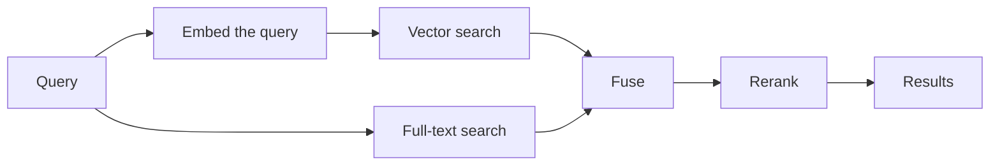

Follow a document from the moment you upload it to the moment it shows up in a query result, then see how a query runs.

## Writing {#write-path}

### 1. Upload {#upload}

A document comes in one of three ways: a file upload, an inline upload, or a watcher that noticed a new file. Whichever way it arrives, it becomes a background processing task.

Cortrix recognizes duplicates by content hash, so uploading the same content again doesn't reprocess it.

### 2. Parse {#parse}

A parser turns the file into text. Plain text is used as it is. PDF, Word, and images need the matching parsers and OCR, which are optional components and aren't turned on in the quickstart.

### 3. Chunk {#chunk}

The text is split into blocks. By default each block targets 512 tokens, and neighboring blocks overlap by 50 tokens to keep context continuous. Blocks are the units that get retrieved later.

### 4. Embed {#embed}

The BGE-M3 model turns each block into a 1024-dimension vector. This happens on your machine, and nothing is sent anywhere else.

### 5. Index {#index}

The vectors go into the vector index, the text goes into the full-text index, and the metadata goes into the database. These writes complete as a unit.

When that's done, the document's status becomes `ready` and queries can find it.

### Why uploads are asynchronous {#why-async}

Parsing and embedding take time, and more of it for larger documents. Running them in the background lets the upload request return right away, and the caller checks progress with a task identifier.

It also means that a successful upload request only tells you the task was accepted. Whether processing succeeded is something you learn from the task progress or the document status.

## Querying {#query-path}

### 1. Retrieve along several paths {#retrieve}

The query text is embedded and used to find semantically similar blocks in the vector index. At the same time, the full-text index is searched by keyword. Each path returns its own set of candidates.

With `?explain=true` you can see which paths a query actually used, for example `"rrf_path_counts": {"dense": 1, "fts5": 1}`.

### 2. Fuse {#fuse}

The candidates from each path are merged into one list by rank. The `score` in a result is this fused score.

### 3. The candidate pool {#candidates}

More candidates move on to the next step than `top_k` asks for. The number comes from `top_k`, the candidate multiplier, and the candidate ceiling together. Fetching more and truncating later gives the reranker room to choose.

### 4. Rerank {#rerank}

The reranker scores the query against each candidate to produce a `rerank_score`. The results are reordered by that score and cut down to the top `top_k`.

Reranking happens before the candidates are truncated. So with reranking on, a candidate that was ranked first can drop out of the results entirely rather than just moving down. That's one reason reranking hurts tasks that are looking for identical items. See [Performance tuning](/docs/deploy/performance-tuning/#rerank).

### 5. Across namespaces {#cross-namespace}

When you query several namespaces, the request is sent to each one, and the results are merged and de-duplicated. One namespace failing doesn't fail the whole query: the parts that succeeded come back as usual, and the failure is recorded in `meta.namespaces_failed`.

## Deleting {#delete-path}

Deleting a document happens in stages:

1. **Soft delete**: the document is marked deleted and disappears from query results right away, but the data is still there and can be restored during the retention period.
2. **Hard delete**: once the retention period passes, garbage collection removes the document's records.
3. **File cleanup**: after a further waiting period, the original file is physically deleted.

The default retention period is 30 days, and the wait before file cleanup is 90 days.

## Memory {#memory-path}

A memory you write explicitly is saved as it is. Editing a memory doesn't change the original record. It creates a new record and marks the old one invalidated. Deleting a memory also only marks it invalidated. Memories are always kept, so their history can be traced.

## Next steps {#next-steps}

- [Architecture overview](/docs/concepts/architecture/)
- [Upload documents](/docs/guides/upload-documents/)
- [Query and rerank](/docs/guides/query/)
