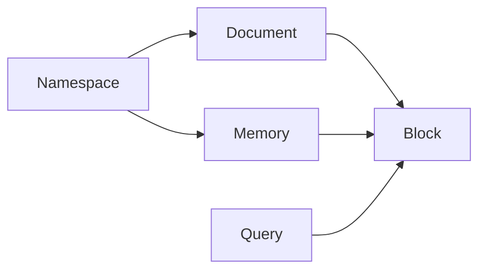

You'll keep running into six concepts when you use Cortrix. Here's what each one means and how they relate.

## How the concepts relate {#relationships}



Documents and memories both belong to a namespace. Documents and memory records produce blocks, and blocks are what a query searches.

## Namespace {#namespace}

A namespace is a logical collection boundary for documents, blocks, memory, and queries. You name a namespace when you write, and you list one or more namespaces when you query.

## Document {#document}

A document is source material you upload to Cortrix. It can be parsed and indexed.

## Block {#block}

A block is the smallest searchable unit, derived from a document or a memory record. Query results are blocks, along with the source each one came from.

## Query {#query}

A query is a retrieval request over one or more namespaces. The request names its scope with a plural `namespaces` array:

```json
{
  "query": "How should an agent recover from an expired setup token?",
  "namespaces": ["your_namespace"],
  "top_k": 5,
  "rerank": true,
  "include_sources": true
}
```

> [!WARNING]
> The deprecated singular `namespace` field is rejected on query requests. Other endpoints may still use a singular namespace field where their OpenAPI definition requires it.

## Memory {#memory}

Memory is structured long-term information, captured from interactions or written explicitly through the API.

## Agent surface {#agent-surface}

An agent surface is a programmatic path that lets an agent use Cortrix: the HTTP API, MCP, the Python SDK, or the built-in Agent service.

## Local models and LLM roles {#models-and-llm-roles}

These two are easy to mix up:

- **Local neural models**: the quickstart uses two local ONNX models. BGE-M3 handles embedding and bge-reranker-v2-m3 handles reranking. They run on your machine's CPU and send nothing to an external service.
- **LLM roles**: `semantic_llm`, `vision_llm`, `agent_llm`, `doc_summary_llm`, and `enricher_llm` are separate, optional capabilities. You configure them only when you're testing a feature that uses them.

So `LLM_ENABLED=false` doesn't mean embedding or reranking is off.

## Next steps {#next-steps}

- [Quickstart](/docs/get-started/quickstart/)
- [Choose an access path](/docs/integrations/overview/)
- [HTTP API reference](/docs/reference/api/)
